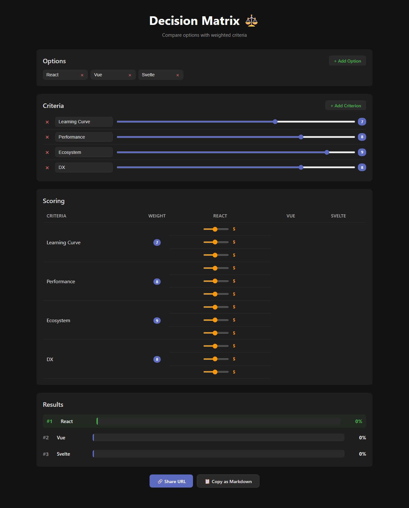

# Decision Matrix ⚖️

A weighted decision matrix tool for comparing options against scored criteria. Great for choosing between frameworks, tools, vendors, or anything where multiple factors matter.

🌐 **[Live Demo](https://vineeththomasalex.github.io/decision-matrix/)**



## Features

- **Weighted scoring** — assign importance (1–10) to each criterion
- **Interactive sliders** — score every option against every criterion
- **Ranked results** — see normalized percentages with a visual bar chart
- **URL sharing** — encode your entire matrix in the URL for easy sharing
- **Markdown export** — copy a formatted table to paste into docs, PRs, or wikis
- **Pre-loaded example** — starts with a React vs Vue vs Svelte comparison

## Tech Stack

- [React 19](https://react.dev/) + TypeScript
- [Vite](https://vite.dev/) for build & dev server
- [Playwright](https://playwright.dev/) for end-to-end tests

## Getting Started

```bash
# Install dependencies
npm install

# Start dev server
npm run dev

# Build for production
npm run build

# Preview production build
npm run preview
```

## Testing

```bash
# Install browser (first time only)
npx playwright install chromium

# Run all tests
npx playwright test

# Run tests with UI
npx playwright test --ui
```

## License

MIT
